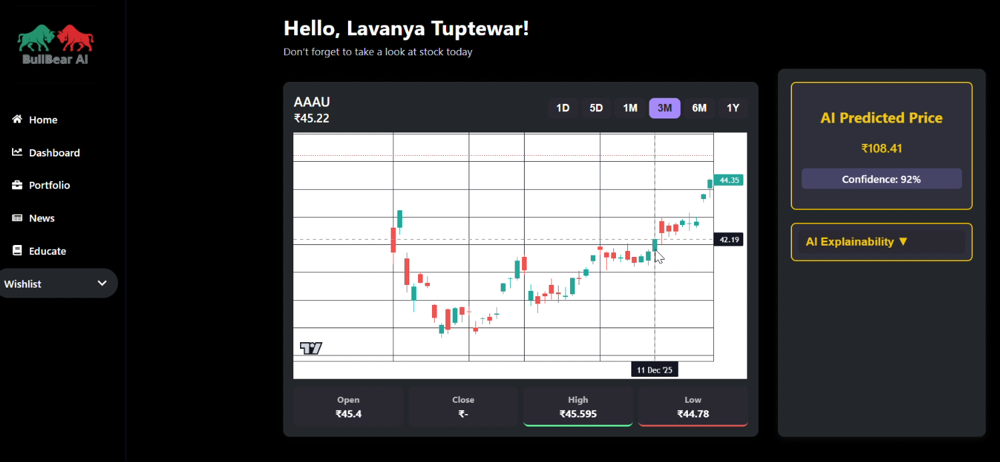
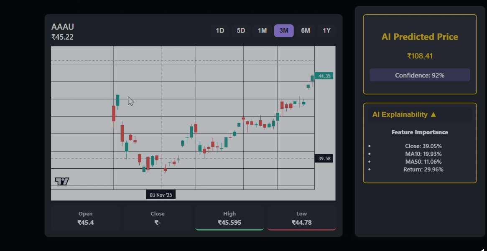
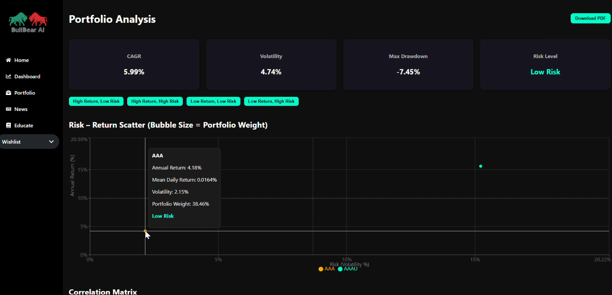
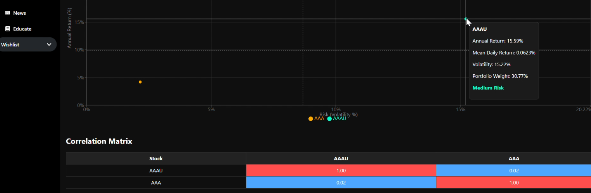
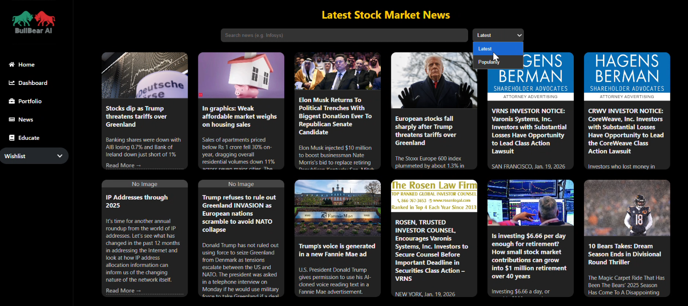

# 📈 BullBear AI  
### AI-Powered Stock Market Analysis and Prediction Platform  

## Overview
**BullBear AI** is an AI-powered stock market and portfolio intelligence platform...

## Problem Statement
Most stock market platforms overwhelm users with charts, numbers, and noise...

## Tech Stack
### Frontend
- React.js, JavaScript, CSS3, Vite, Chart.js / Recharts

### Backend
- Python, Flask, REST API

### Machine Learning & Analytics
- TensorFlow, Keras, LSTM, NumPy, Pandas, Scikit-learn

### Data Sources
- Yahoo Finance, Alpha Vantage, Financial Modeling Prep, NewsAPI

## Architecture
[Add system architecture diagram and description here]

## Functional Requirements
- Stock search and dashboard
- AI price prediction (LSTM)
- Portfolio analytics engine
- Market news & sentiment analysis
- Investor education & explainable insights

## Non-Functional Requirements
- Fast and responsive UI
- Secure API endpoints
- Scalability to support multiple concurrent users
- Reliable and accurate ML predictions

## Repository Layout

## 🚀 Project Overview — BullBear AI

**BullBear AI** is an AI-powered stock market and portfolio intelligence platform designed to transform raw market data into clear, explainable, and risk-aware insights for students, beginners, and retail investors.

Most stock market platforms overwhelm users with charts, numbers, and noise — but fail to answer the most important questions:

- Why is a stock moving?
- How risky is my investment?
- What can I realistically expect next?
- How do my stocks behave together as a portfolio?

BullBear AI addresses this gap by combining **real-time market data, portfolio-level analytics, and machine learning models** into a single interactive dashboard — helping users move from emotional decision-making to data-driven understanding.

---

## 👤 Team Details
- **Team Name:** InnovateX (Solo)
- **Participant:** Lavanya Tuptewar
- **Hackathon:** HackXIndia Hackathon 2026
- **Domain:**  AI & Automation(AI for Bharat)

---
## 🎥 Demo Video

📽️ **Project Walkthrough & Demo:**  
👉 [Watch the BullBear AI Demo Video](https://drive.google.com/drive/folders/1bFjOkoT99ZmCDYTcyGNa17-CgOaNZ7yF)

This video demonstrates:
- Homepage & navigation flow
- Stock search and dashboard
- AI-based price prediction (LSTM)
- Portfolio analytics (CAGR, volatility, drawdown, correlation)
- Overall system architecture and features


---
## 🧰 Built With

### Frontend


---

### Backend


---

### Machine Learning & Analytics


---

### Data Sources & Tools


## 🖼️ Screenshots

### 🏠 Homepage


### 📈 Stock Dashboard


### 🤖 AI Price Prediction


### 📊 Portfolio Analytics


### 🔗 Correlation Matrix


### 📰 Market News & Sentiment


### 📚 Investor Education & Insights


## 🚀 Features  & Unique Strengths

### 🔍 Stock Search & Interactive Dashboard
- Search any U.S. stock (AAPL, MSFT, TSLA, etc.)
- Dedicated dashboard per stock
- Live & historical price visualization
- Interactive charts for trend analysis
**USP:** Combines price data with analytical context, not just charts.
---

### 🤖 AI Price Prediction (LSTM)
- Predicts **next-day closing price**
- Trained on **15+ years of historical U.S. stock market data using historical **OHLC data**  
- Uses **LSTM (Long Short-Term Memory)** neural networks
- Displays:
  - Predicted price
  - **confidence score** based on prediction error

---
### 📊 Portfolio Analytics Engine
- Professional-grade portfolio evaluation similar to institutional tools  
- Key metrics:
  - CAGR (Compound Annual Growth Rate)
  - Volatility (Risk)
  - Maximum Drawdown
  - Overall Risk Classification  
- Works on portfolios as a **system**, not isolated stocks

### ⚖️ Risk–Return & Diversification Analysis
- Interactive risk–return scatter visualization  
- Correlation matrix showing relationships between assets  
- Identification of over-exposed and under-diversified positions  
- Clear insights into risk concentration  

**USP:** Visual analytics make complex financial concepts instantly understandable.


### 📰 Market News & Sentiment Analysis
- Stock-related news aggregation
- Sentiment classification:
  - 🟢 Bullish
  - 🔴 Bearish
  - ⚪ Neutral

---

### 🔥 Trending Stocks
- Top gainers
- Top losers
- Most active stocks
- Backend caching for improved performance

---
### 📚 Investor Education & Explainable Insights
- Educational explanations for financial metrics  
---

## 🧠 AI Price Prediction – How It Works

### 📊 Data Foundation (2010–2025)

- Trained on **15+ years of historical U.S. stock market data**
- Covers **148+ actively traded stocks**
- Data includes:
  - Open, High, Low, Close (OHLC)
  - Trading Volume
  - Daily Returns
  - Volatility & Momentum Indicators

📈 Built to generalize across multiple market cycles:
- Bull markets  
- Bear markets  
- High-volatility periods (COVID, inflation cycles, interest rate hikes)

---


### ⚙️ Prediction Pipeline

**1️⃣ Historical Pattern Learning**  
- Learns short-term and long-term price behavior using rolling time windows

**2️⃣ Feature Engineering**  
- Converts raw price data into meaningful indicators:
  - Moving averages
  - Price momentum
  - Volatility trends
  - Return distributions

**3️⃣ Machine Learning Model**  
- Supervised learning model trained to predict the **next trading day’s opening price**
- Designed to reduce intraday noise while capturing directional bias

**4️⃣ Confidence-Aware Output**  
- Provides:
  - Directional insight (Bullish / Bearish bias)
  - Confidence indicators to discourage over-reliance on predictions

---
### Model
- **LSTM (Deep Learning – Time Series Forecasting)**
- **Input:** Last *N* days of OHLC data
- **Output:** Next trading day closing price

### 🔍 Explainable AI (XAI)

Unlike black-box prediction systems, BullBear AI emphasizes **interpretability**:

- Highlights historical trends influencing predictions  
- Encourages users to understand *why* a movement is expected  
- Promotes learning and informed decision-making  

---

### 🚀 Unique Selling Points (USP)

- ✔ Trained on long-term market data (2010–2025) for stronger generalization  
- ✔ Focused on **education-first AI**, not speculative trading  
- ✔ Designed for students, beginners, and retail investors  
- ✔ Combines prediction + explanation + risk awareness  
- ✔ Integrates seamlessly with portfolio-level analytics  

---

📌 **Dynamic Prediction**
- If today is jan 21 → predicts jan 22
- No hard-coded dates

---

## 🧱 Tech Stack

### Frontend
- **React.js** – Component-based UI development  
- **JavaScript (ES6+)** – Client-side logic and interaction  
- **CSS3** – Responsive and modern styling  
- **Vite** – Fast development server and build tool  
- **Chart.js / Recharts** – Interactive financial data visualizations  
- **React Router** – Client-side routing and navigation  

### ⚙️ Backend
- **Python** – Core backend and analytics logic  
- **Flask** – Lightweight REST API framework  
- **RESTful APIs** – Communication between frontend and backend  


### 🤖 Machine Learning & Analytics
- **TensorFlow / Keras** – Deep learning model training and inference  
- **LSTM (Long Short-Term Memory)** – Time-series stock price prediction  
- **NumPy** – Numerical computations  
- **Pandas** – Data processing and feature engineering  
- **Scikit-learn** – Data scaling and evaluation metrics

  
### 📊 Data Sources
- **Yahoo Finance (`yfinance`)** – Historical and live stock market data  
- **Alpha Vantage API** – Financial indicators and market data  
- **Financial Modeling Prep API** – Stock fundamentals and market insights  
- **NewsAPI** – Stock-related news and sentiment context  

---

## 📁 Project Structure

HackXIndia-Hackathon-2026/
│

├── client/ # React frontend

│ ├── pages/

│ ├── components/

│ └── App.jsx

│
├── server/

│ ├── app.py # Flask backend

│ ├── ml/

│ │ ├── train_lstm.py # Model training

│ │ └── predict.py # Prediction logic

│ ├── data/ # CSV datasets (ignored in Git)

│ ├── models/ # Saved ML models

│ └── api/

│
├── .env.example # Environment variables template

├── .gitignore

└── README.md

## 📡 API Endpoints

### Market Data
GET /api/stocks
– Fetch supported stock symbols

GET /api/stocks/{symbol}
– Get historical price data for a stock

### AI Price Prediction
POST /api/predict
– Predict next-day opening price with confidence score

### Portfolio Analytics
POST /api/portfolio/analyze
– Analyze portfolio risk, return, and diversification

### Correlation & Risk
POST /api/portfolio/correlation
– Generate correlation matrix for portfolio assets

### News & Sentiment
GET /api/news/{symbol}
– Fetch latest market news for a stock

---

## ⚙️ Setup Instructions
From setup to launch in minutes!

### 1️⃣ Clone Repository
```bash
git clone https://github.com/LavanyaT809/HackXIndia-Hackathon-2026.git
cd HackXIndia-Hackathon-2026

cd server
python -m venv venv
venv\Scripts\activate
pip install -r requirements.txt

ALPHA_VANTAGE_KEY=your_key
FMP_API_KEY=your_key
NEWS_API_KEY=your_key

python app.py

3️⃣ Frontend Setup
cd client
npm install
npm run dev

📊 Model Training (Optional)
cd server/ml
python train_lstm.py

```
---
## 🧠 Why I Built This

Most retail investors and students rely on price charts without understanding **risk, diversification, or portfolio behavior**.  
Existing platforms focus on *what the price is*, but rarely explain *why it moves* or *how assets interact together*.

I built **BullBear AI** to bridge this gap — by combining **explainable analytics, portfolio intelligence, and responsible AI** into a single, beginner-friendly platform.

The goal is not to predict markets blindly, but to help users **think like informed investors**, understand risk before returns, and make data-driven decisions with confidence.


### ⚠️ Planned AI Enhancements
- Volatility-based risk analysis
- Anomaly detection (price & volume spikes)
- AI-generated stock summaries

## 🤝 Contributing

This project was developed as a hackathon and learning-focused initiative.

Suggestions, feedback, and improvements are welcome.
If you’d like to contribute:

1. Fork the repository  
2. Create a new feature branch  
3. Submit a pull request with a clear description  

For major changes, please open an issue first to discuss the idea.

  
### ⚠️ Responsible AI Disclaimer

BullBear AI is an **educational decision-support system**, not a financial advisory tool.  
All predictions are probabilistic and intended to enhance understanding — **not replace human judgment or professional advice**.

